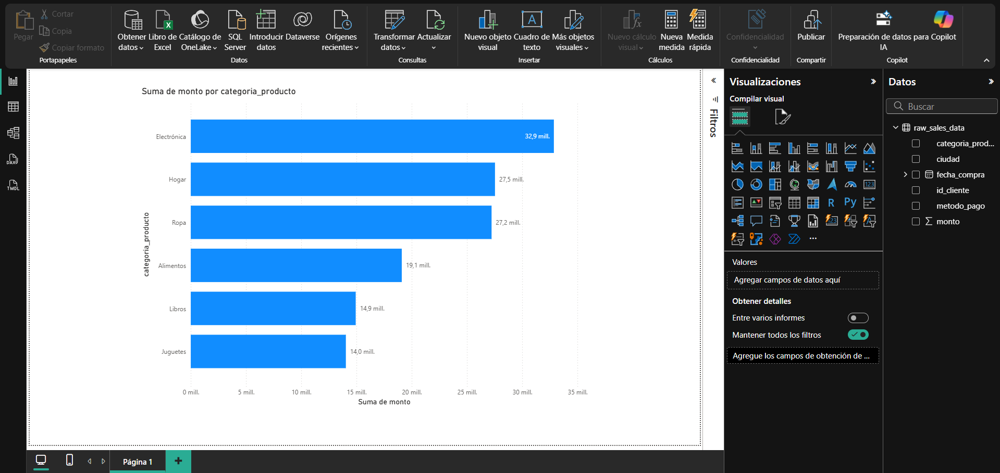

# Lufemage Data Lab: End-to-End Sales Analysis


This project simulates a complete data analysis workflow for a junior data analyst role. It demonstrates the ability to handle a data project from inception to final reporting, including data generation, cleaning, analysis, insight generation, and visualization.

## Project Overview

As a Junior Data Analyst at Lufemage Labs, I was tasked with creating a functional prototype for sales analysis. The objective was to showcase the lab's capability to transform raw data into actionable business intelligence. Since no pre-existing data was provided, this project includes a custom script to generate a realistic synthetic dataset simulating sales transactions.

---

## Project Phases

The analysis followed a structured, multi-phase approach:

1.  **Phase 1: Synthetic Data Generation**: A Python script using `Faker` and `NumPy` was developed to create a realistic dataset of 5,000 sales records, including customer IDs, purchase dates, amounts, product categories, cities, and payment methods.
2.  **Phase 2: Exploratory Data Analysis (EDA)**: The dataset was loaded into a Jupyter Notebook for initial exploration. This included data cleaning (e.g., converting data types), checking for duplicates/nulls, and calculating descriptive statistics.
3.  **Phase 3: Insight Generation**: Deep-dive analysis was performed using `pandas` to answer key business questions by grouping and aggregating data.
4.  **Phase 4: Data Storytelling**: The findings were synthesized into a coherent narrative, transforming raw analysis into a compelling story for stakeholders.
5.  **Phase 5: Data Visualization**: Key insights were visualized using `Matplotlib` and `Seaborn` to create clear, impactful charts and a final summary dashboard.

---

## Key Business Questions Addressed

*   Which products or categories generate the most revenue?
*   Which cities are the top-performing markets?
*   Are there specific times (day of the week, hour) when sales peak?
*   What are the most popular payment methods among customers?
*   What is the average transaction value (ATV) per city?

---

## Tech Stack

*   **Language:** Python 3.9
*   **Libraries:**
    *   **Data Manipulation:** Pandas, NumPy
    *   **Data Generation:** Faker
    *   **Data Visualization:** Matplotlib, Seaborn
    *   **Development Environment:** JupyterLab

---

## Project Structure
```bash 
lufemage-data-lab/
├── .venv/
├── data/
│ ├── raw_sales_data.csv # Generated raw data
│ └── figures/
│    └── sales_analysis_dashboard.png # Exported dashboard image
├── notebooks/
│ └── 01_sales_analysis.ipynb # Main analysis notebook
├── scripts/
│ └── generate_dataset.py # Script to generate synthetic data
├── .gitignore
├── README.md
└── requirements.txt
```
---

## Setup and Installation

To run this project locally, follow these steps:

1.  **Clone the repository:**
    ```bash
    git clone https://github.com/Elimge/lufemage-data-lab.git
    cd lufemage-data-lab
    ```

2.  **Create and activate a virtual environment:**
    ```bash
    # For macOS/Linux
    python3 -m venv .venv
    source .venv/bin/activate

    # For Windows
    python -m venv .venv
    .venv\Scripts\activate
    ```

3.  **Install the required dependencies:**
    ```bash
    pip install -r requirements.txt
    ```

---

## How to Run the Project

1.  **Generate the dataset:**
    Run the generation script from the root directory. This will create `raw_sales_data.csv` inside the `data/` folder.
    ```bash
    python scripts/generate_dataset.py
    ```

2.  **Run the analysis notebook:**
    Start JupyterLab and open the notebook located in the `notebooks/` directory.
    ```bash
    jupyter lab
    ```
    Navigate to `notebooks/01_sales_analysis.ipynb` and run the cells to see the complete analysis.

---

## Key Findings & Dashboard

The analysis revealed a clear profile of the primary customer: an urban, tech-savvy consumer, likely from Bogotá, who plans purchases for the weekend and prefers digital payment methods.

### Summary Dashboard


### Actionable Recommendations

1.  **Focus on Core Strengths:** Launch a hyper-segmented marketing campaign for the 'Electronics' category, targeting the Bogotá market as a testbed for new product offerings.
2.  **Optimize Marketing Timing:** Align digital marketing campaigns to activate on Thursday afternoons and intensify during peak purchasing hours (2 PM - 6 PM) on weekends.
3.  **Enhance User Experience:** Prioritize a technical audit of the credit card payment flow to ensure it is seamless, as it accounts for 50% of all transactions.

### Executive Presentation

For a summary of the key findings and strategic recommendations, you can view the full executive presentation prepared for stakeholders.

[➡️ **View the Full Presentation (PDF)**](./docs/Lufemage_Sales_Presentation.pdf)

### Business Intelligence (BI) Dashboard Prototype

To demonstrate the integration between Python-based analysis and industry-standard BI tools, a prototype dashboard was created in **Power BI**. This visualizes one of the core findings: revenue distribution by product category. This step proves the data is ready for business-level reporting and monitoring.



---

## Future Improvements

*   Apply statistical tests to validate hypotheses (e.g., A/B testing promotional strategies).
*   Build a simple predictive model to forecast sales for the next quarter.

---

## Author

*   **Miguel Canedo Vanegas** 
*   GitHub: `@Elimge` 
*   **Email:** elimge@outlook.com

